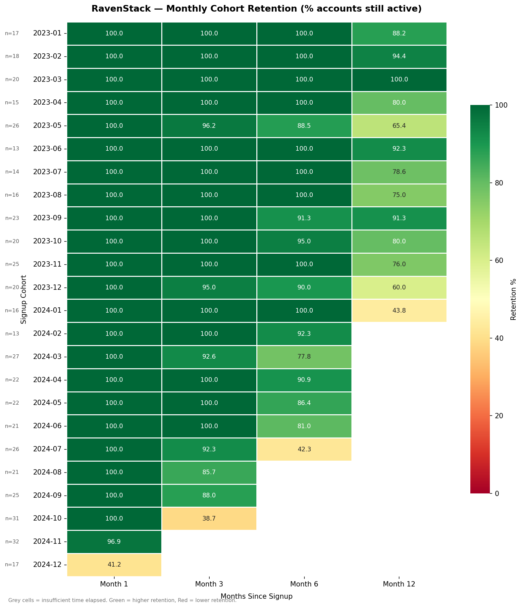
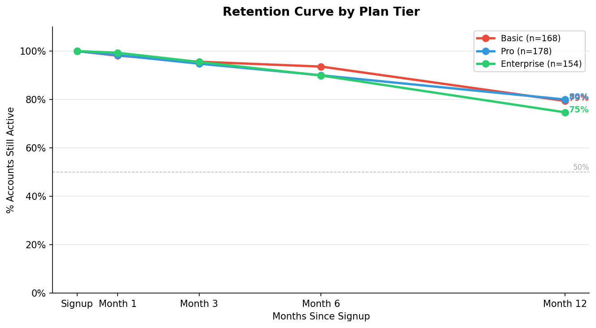
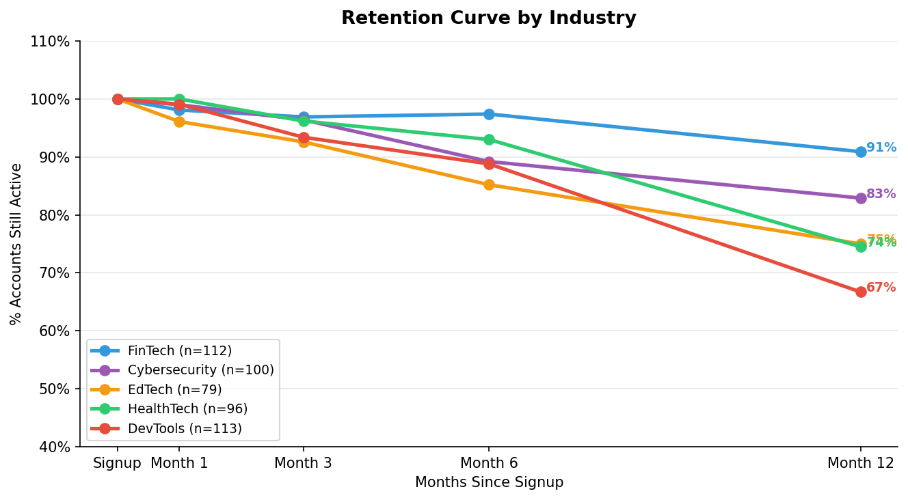
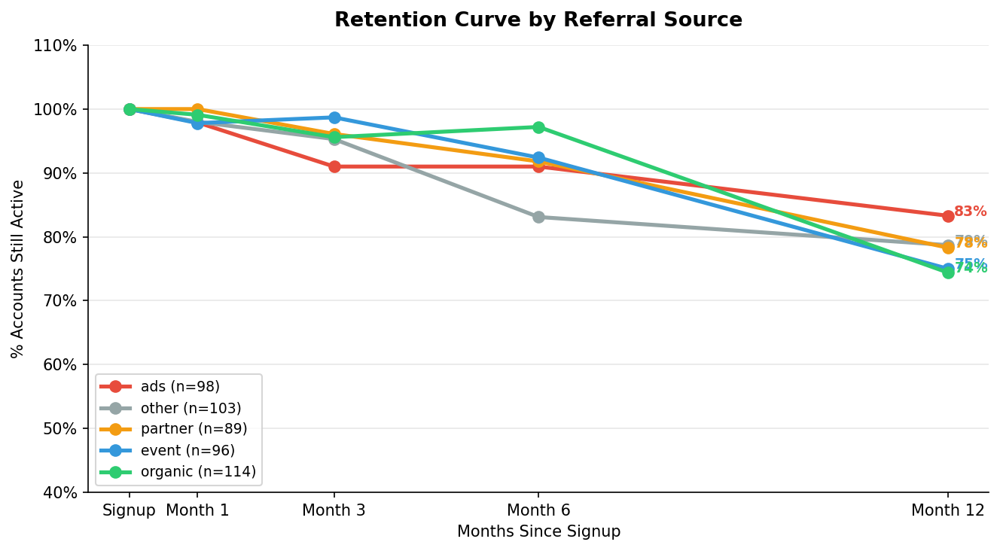
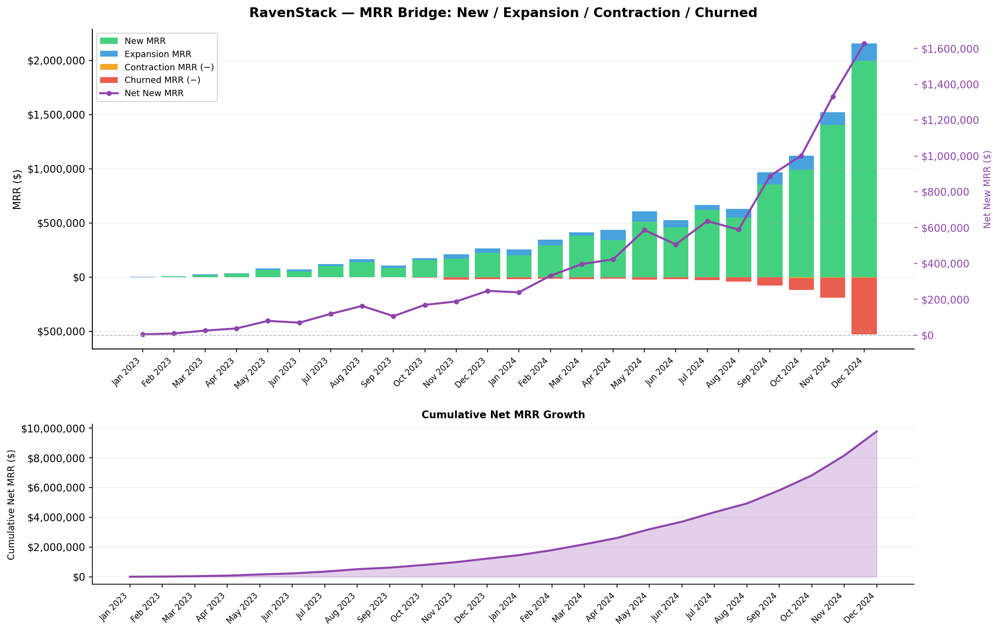
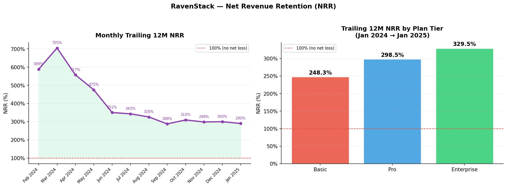
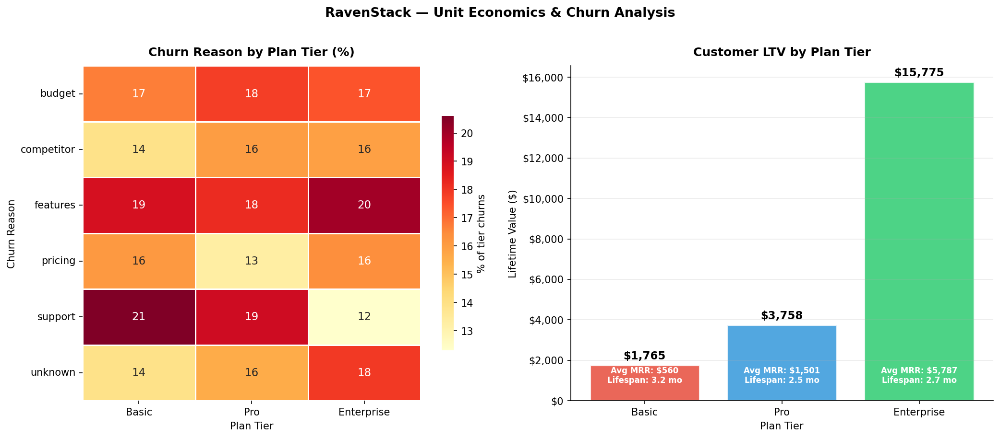

# RavenStack SaaS Growth & Retention Analysis

A multi-table subscription analytics project analysing 500 accounts, 5,000 subscription records, and 600 churn events from the RavenStack synthetic SaaS dataset.

**Tools:** Python (pandas, matplotlib, seaborn) · Excel (openpyxl) · Jupyter Notebooks
**Dataset:** [SaaS Subscription & Churn Analytics Dataset](https://www.kaggle.com/datasets/rivalytics/saas-subscription-and-churn-analytics-dataset) 

---

## Project Structure

```
ravenstack-saas-analysis/
├── data/
│   ├── accounts.csv
│   ├── subscriptions.csv
│   ├── churn_events.csv
│   ├── feature_usage.csv
│   └── support_tickets.csv
├── notebooks/
│   ├── 01_cohort_retention.ipynb
│   ├── 02_mrr_bridge.ipynb
│   └── 03_unit_economics.ipynb
├── outputs/
│   ├── cohort_heatmap.png
│   ├── retention_by_tier.png
│   ├── retention_by_industry.png
│   ├── retention_by_referral.png
│   ├── mrr_bridge.png
│   ├── nrr_trend.png
│   ├── unit_economics_charts.png
│   └── unit_economics_table.xlsx
└── README.md
```

---

## Analyses

### 1. Cohort Retention (`01_cohort_retention.ipynb`)

Joined `accounts.csv` + `subscriptions.csv` on `account_id`. Grouped accounts by signup month (cohort) and tracked what percentage remained active at Month 1, 3, 6, and 12 checkpoints.

**Output:** Cohort heatmap (all cohorts × 4 time checkpoints) + retention curves segmented by plan tier, industry, and referral source.









---

### 2. MRR Bridge (`02_mrr_bridge.ipynb`)

Decomposed month-over-month MRR movement from `subscriptions.csv` into:

- **New MRR** — brand-new paid subscriptions (no upgrade or downgrade flag)
- **Expansion MRR** — upgrades that started this month (`upgrade_flag = True`)
- **Contraction MRR** — MRR delta lost from downgrades (`prev_mrr − new_mrr` per downgrade pair)
- **Churned MRR** — subscriptions that fully ended this month, excluding accounts that merely downgraded
- **Net New MRR** — New + Expansion − Contraction − Churned

**Output:** Stacked bar + Net MRR overlay + cumulative growth chart.



---

### 3. Unit Economics, NRR & Churn Drivers (`03_unit_economics.ipynb`)

Calculated per-tier unit economics (Avg MRR, Avg Lifespan, LTV, Monthly Churn Rate, LTV:MRR Ratio, NRR) from `subscriptions.csv` and cross-tabulated churn reason codes by plan tier from `churn_events.csv`.

**NRR methodology:** Trailing 12M NRR — take all accounts with active MRR on 1 Jan 2024, measure their combined MRR 12 months later (churned accounts contribute $0). NRR > 100% means existing customers are net expanding in revenue.

**Output:** NRR trend chart (monthly + by tier) + unit economics charts + formatted Excel workbook (3 sheets: Unit Economics · Churn Drivers · Strategic Recommendations).





---

## Key Findings

- **Month 6–12 is the critical churn window.** Average retention across all cohorts drops from 91.3% at Month 6 to 78.8% at Month 12 — a 12.5 percentage point fall, steeper than any earlier interval. Retention holds relatively stable in the first 6 months (Month 1: 97.4%, Month 3: 94.9%), making the second half of year one the highest-risk period for churn.

- **Enterprise LTV ($15,775) is 8.9× Basic LTV ($1,765).** The tier differential is driven by MRR rather than lifespan — Enterprise accounts pay $5,787/month vs $560/month for Basic, with comparable average subscription lengths across tiers. This confirms a strong upsell ROI: converting one Basic account to Enterprise replaces the LTV of ~9 Basic accounts.

- **Support issues drive Basic and Pro churn (21% and 19% respectively); Enterprise churns primarily on missing features (20%).** This points to two separate retention strategies: self-serve support improvements for lower tiers, and roadmap communication / feature delivery prioritisation for Enterprise accounts.

- **NRR exceeds 100% across all tiers (Basic 248%, Pro 299%, Enterprise 330%).** All cohorts are net-expanding — existing customers are adding more subscriptions than they churn, with Enterprise accounts growing revenue the fastest. Monthly trailing 12M NRR declined from ~590% (Feb 2024) to ~290% (Jan 2025) as the customer base matured and the expansion rate normalised relative to a larger base.

---

## Strategic Recommendations

- **Build Month-6 churn-risk alerts before any other retention initiative.** The 6→12 month window is where retention drops hardest (−12.5pp — steeper than the entire first 6 months combined). Flag accounts approaching 5-month tenure that show below-median feature usage for proactive CSM outreach. Referral-source data adds a targeting layer: ads-acquired accounts retain at 83.3% vs organic at 74.4% at Month 12, so organic cohorts should be prioritised in early intervention programs.

- **Treat Enterprise NRR as the primary growth lever, not new logo acquisition.** Enterprise NRR is 330% — existing Enterprise accounts are already tripling revenue without new logos. With an 8.9× LTV differential over Basic and the fastest-expanding NRR tier, resources spent deepening Enterprise relationships return more than equivalent spend on Basic acquisition (where ~11% monthly churn rapidly offsets CAC). The priority upsell path is Basic → Enterprise, not Basic → Pro → Enterprise.

- **Run separate retention playbooks per tier — and weight CSM time toward FinTech.** Basic and Pro churn is a support problem (21% and 19% of events respectively): fix ticket SLAs, invest in self-serve docs, and deploy 30/60/90-day onboarding check-ins. Enterprise churn is a roadmap problem (20%): public feature delivery timelines and quarterly business reviews reduce "missing features" as a churn driver. Across all tiers, FinTech accounts retain at 90.9% at Month 12 vs DevTools at 66.7% — a 24.2pp gap — making them the highest-value segment for renewal effort and upsell targeting.

---

## How to Run

```bash
# 1. Install dependencies
pip install pandas numpy matplotlib seaborn openpyxl jupyter python-dateutil

# 2. Run notebooks (from project root)
jupyter nbconvert --to notebook --execute --output-dir=notebooks notebooks/01_cohort_retention.ipynb
jupyter nbconvert --to notebook --execute --output-dir=notebooks notebooks/02_mrr_bridge.ipynb
jupyter nbconvert --to notebook --execute --output-dir=notebooks notebooks/03_unit_economics.ipynb

# Or open interactively
jupyter notebook
```

Outputs are written to `outputs/`. All notebooks are self-contained and read from `data/`.

---

